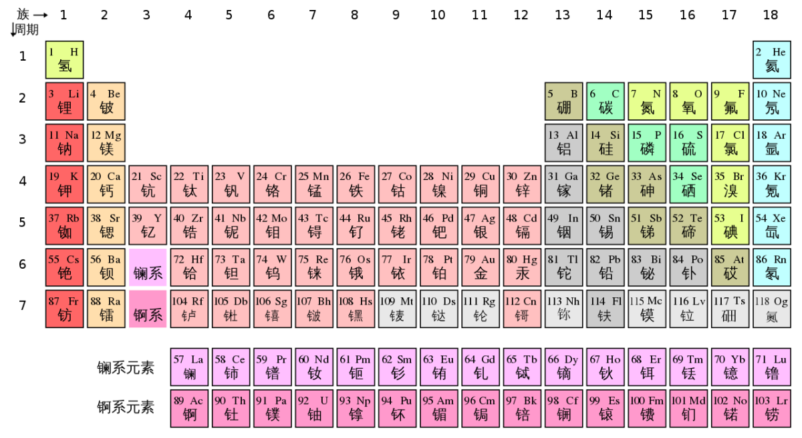

# Titulo principal

### Un subtítulo

Esto es un **archivo** que muestra los diferentes *tipos* de markdown en `github` que hay

Un trozo de código.
```
if(num>3){
System.out.pritnln("El numero es mayor de tres")
}else{
System.out.println("El numero es menor de tres")
}
```

1. estudiar Java
2. estudiar JS
3. estudiar BBDD

- patata
- zanahoria
- lechuga
- aguacate

[Mi bomboclat](https://www.tiktok.com/@kikigee1/video/7461562468276391201)

[Readme.md](README.md)



| Lunes | Martes | Miercoles | Jueves | Viernes | Sabado | Domingo |
| ----------- | ----------- | ------ | ---|---|---|---|
| Special | Special | Special | Special | Special | Special | Marvelous |
| Week | Week | Week | Week | Week | Week| Sunday |
